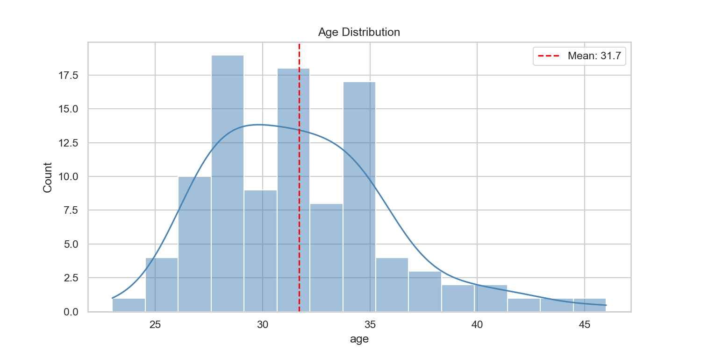
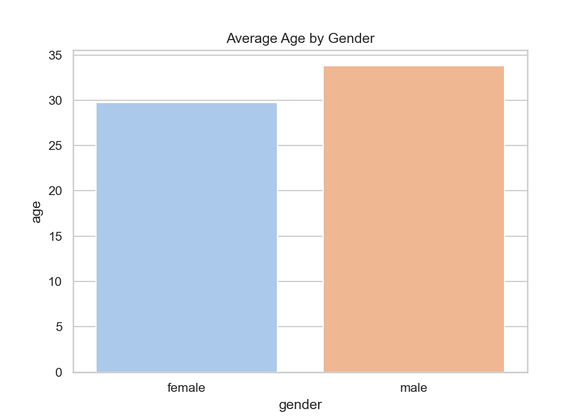
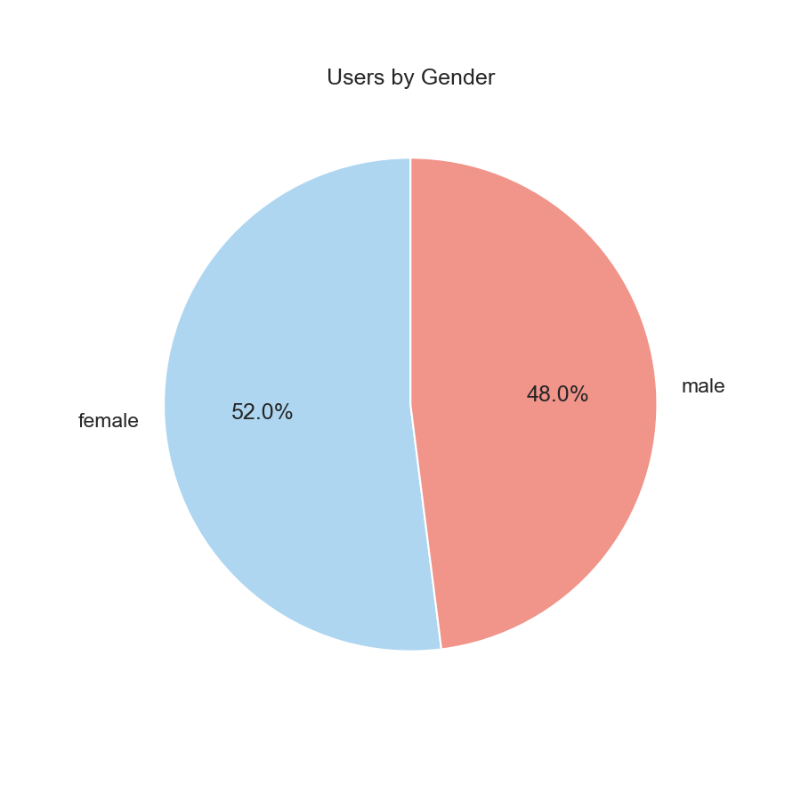
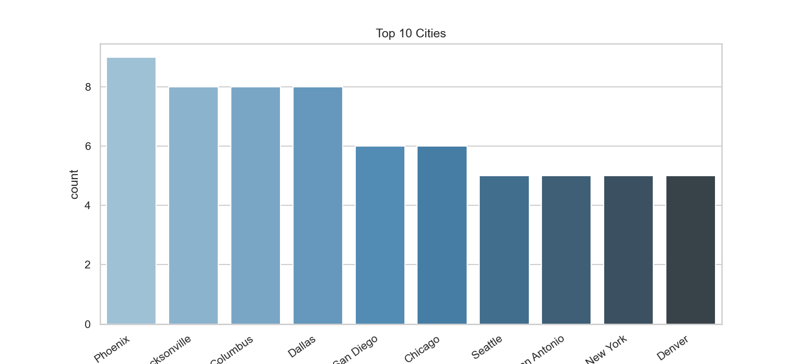
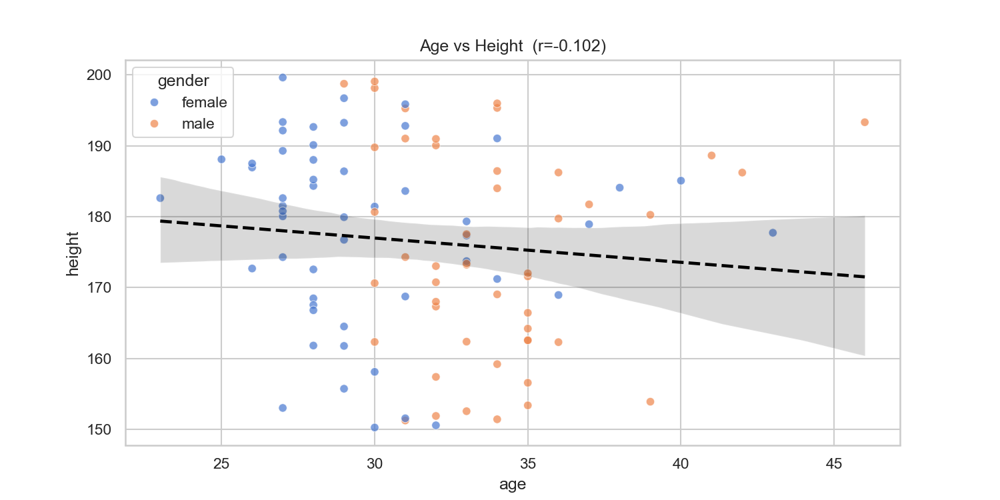
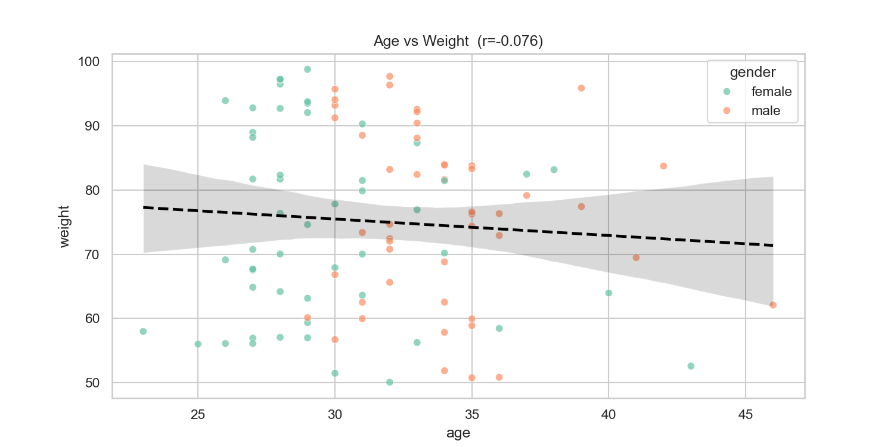
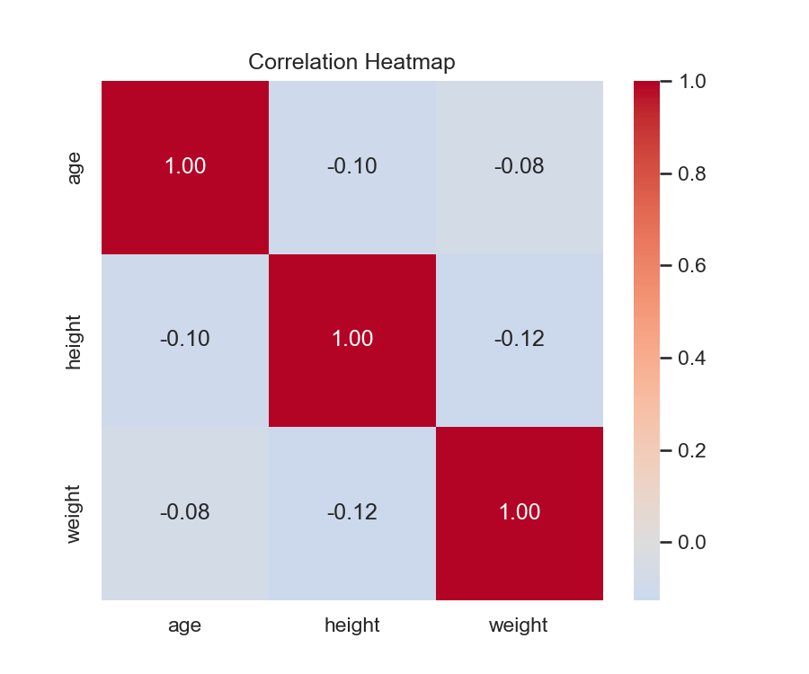

# User Demographics EDA

I built this project to practice data analysis using a real API.  
It pulls 100 users from DummyJSON, cleans the data, and answers some basic questions about the users through visualizations.

---

## Files
- `read.py` — fetches data from the API and saves it as CSV
- `main.py` — runs the analysis and generates the plots
- `analysis.ipynb` — same thing but in notebook format
- `users.csv` — the data

---

## How to run
```bash
pip install requests pandas seaborn matplotlib
python read.py
python main.py
```

---

## Questions I explored
- What's the average age?
- Does age differ by gender?
- Which cities have the most users?
- Is there any link between age and height or weight?

---

## Plots








